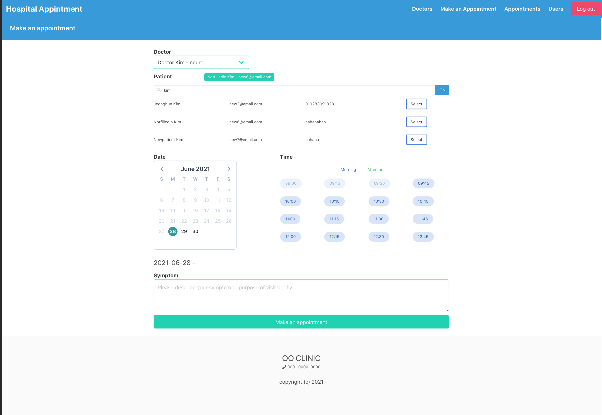
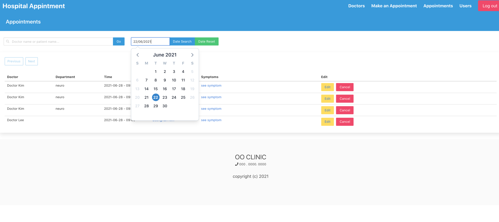
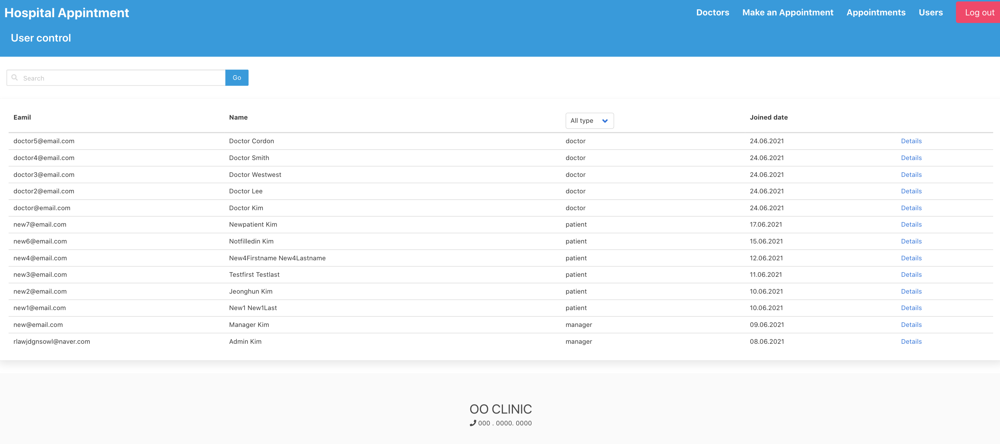
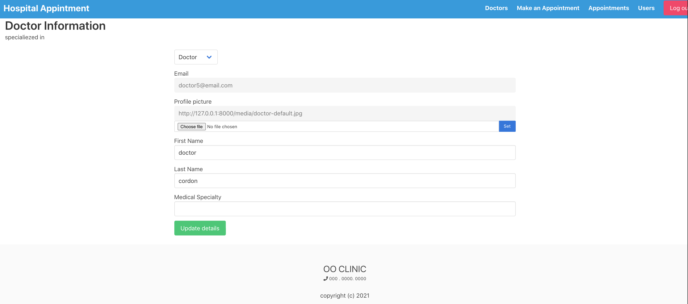

# Hospital Appointment Management

A project created by Django rest API and Vue js.

A project that users can register and login to make appointments on a specific date and time upon requests.

## Overview

1. [Set up for Demo](#set-up-for-demo)
2. [What it does](#what-it-does)
3. [Frameworks & Languages used](#frameworks-and-languages-used)


## Set up for Demo

1. Create a virtual environment and activate it.

2. Run below commands where the `requirements.txt`  is to install dependencies for the backend and run the server where `manage.py` is

    ```bash
    pip install -r requirements.txt
    python manage.py makemigrations
    python manage.py migrate
    python manage.py runserver
    ```

3. Run below commands where the `package.json` is to install dependencies for the frontend and run the server.

    ```bash
    npm install
    npm run serve
    ```


## What it does..

#### User types

User Model is defined with CustomUser Model in the django and each of the User Model has OnetoOne relationships to user types(either 'patient' or 'doctor', because 'manager' user type doesn't have to have personal information for this app. so creating manager user type model is excluded).

1. Patients
    * It is a default user type when new user is registered.
    * *User type patient can be changed to either doctor or manager.*
    * Patients can edit their information at the *patient info* page.
    * Patients can access to the their own appointments list.
    * Patients can make an appointment on requested date and a specific timeslot

2. Doctors
    * Doctors can edit their information and upload profile picture at the doctor info page.
    * Doctors can access to the their own appointments list.
    * Doctors can create appointments on requested date and a specific timeslot as well as patients can.
3. Managers
    * Managers can edit all user types' information.
    * Managers can make appointments as well as cancelatiion and change.
    * Managers can browse all the appointmens list.

#### Pages

Most of the pages are not allowed for users to access without an authentication except a main page and a doctors list page.

1. Login/Sign up
    * This web app uses *token authentication* and to keep including tokens in every request, tokens will be set/saved in localStorage by Vue.js
    * In addition to that tokens, user's user_type and email are also set in localStorage for later usages to fetch data from backend.
    * Before reaching every page, this will direct anonymous user to login page if the page is login required and if request user is unauthenticated.
2. Doctors list page
    * This page returns Doctors list. Since DoctorViewset's queryset is used to create new doctor object if there is no doctor data, this data(Doctors list) is returned from separated endpoint of ListAPIView.
3. Make an appointment page
    * This page can be accessed by all the user type(doctor, manager, patient) but this page will check if usertype is a patient and patient detail(insurance number) is filled in otherwise, it will direct patient user to patient info page.
    * If user type is either doctor or manager, it will display patient *search bar* to allocate patient to current appointment.
    * From Vue.js side, every time clicking date on the calendar box, this will receive the timeslots which already have been booked upon the selected date and a doctor then will disable the timeslot buttons.
    * After creation of appointments, user will be directed to appointments page.
4. Appointments page
    * This page will display upon user type, if request user is either doctor or patient, the only related appointment queryset will be returned. If request user is manager, all the appointments queryset will be returned.
    * Manager can search specific appointments with keyword for patients names or doctor names as well as date.
    * Manager can also edit or delete appointments.
5. Users page(only manager)
    * This page fetches all users list and can be searched by name and email, also can be sorted by user type.
    * This page have links to users details.
6. User info page(Patient info, Doctor info)
    * When users firstly access to this page, patient model will be created if there's no object related to requested user by default.
    * User whose user_type is manager can change user type from patient to two other types(manager, doctor) and on the other way around.
    * Doctor info page
        * Doctor profile picture can be updated by separated serializer for uploading.
        * So `DoctorSerializer` has `picture` field as `read_only=True`.

7. pictures
    
    
    
    

## Frameworks and languages used

* Backend: [Django REST Framework(Python)](https://www.django-rest-framework.org)
* Frontend: [Vue.js(Javascript)](https://vuejs.org)
* CSS framework: [Bulma](https://bulma.io)

